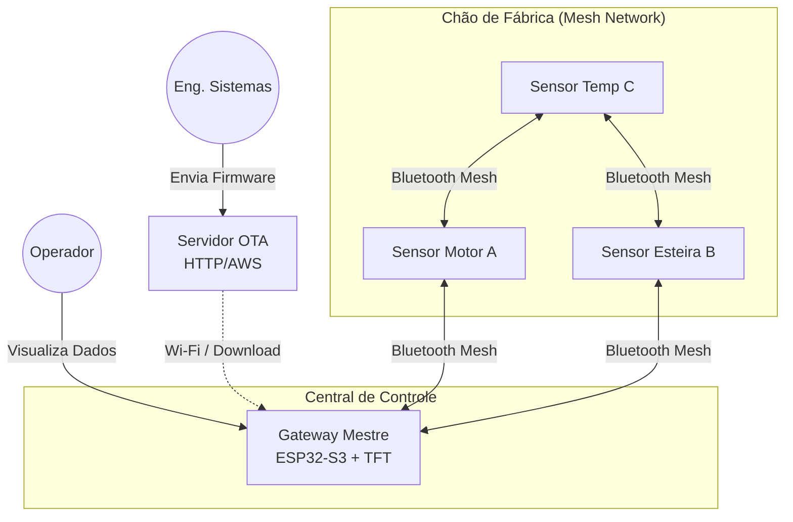
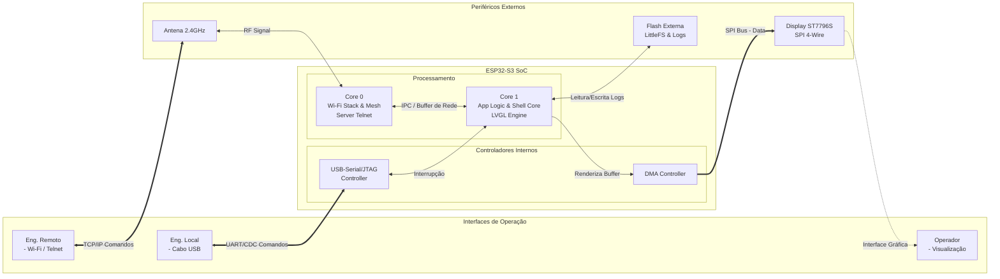
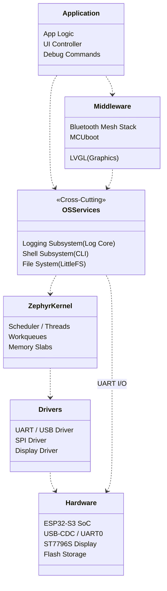
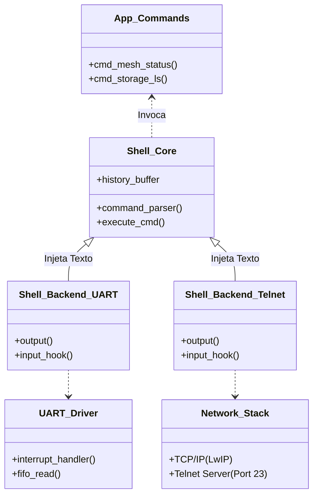
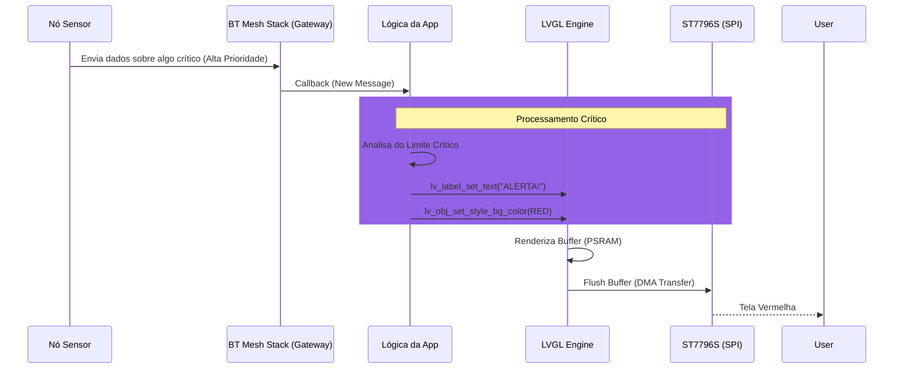
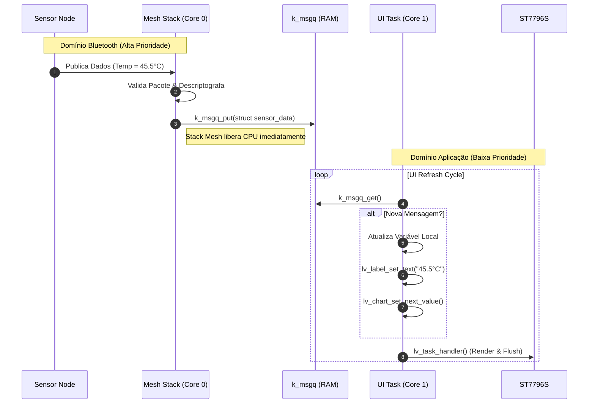
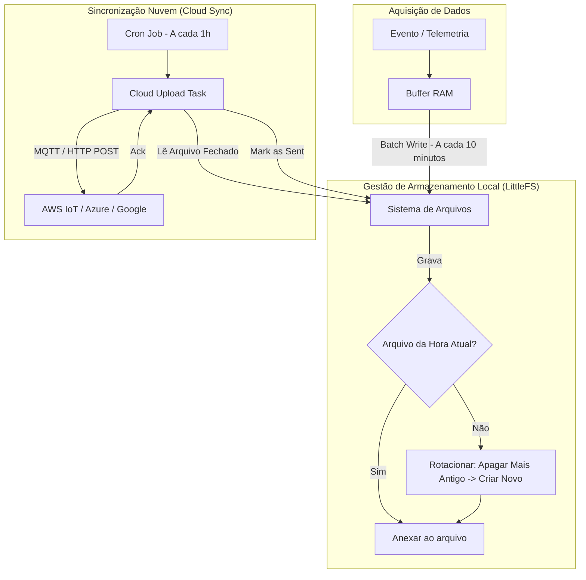
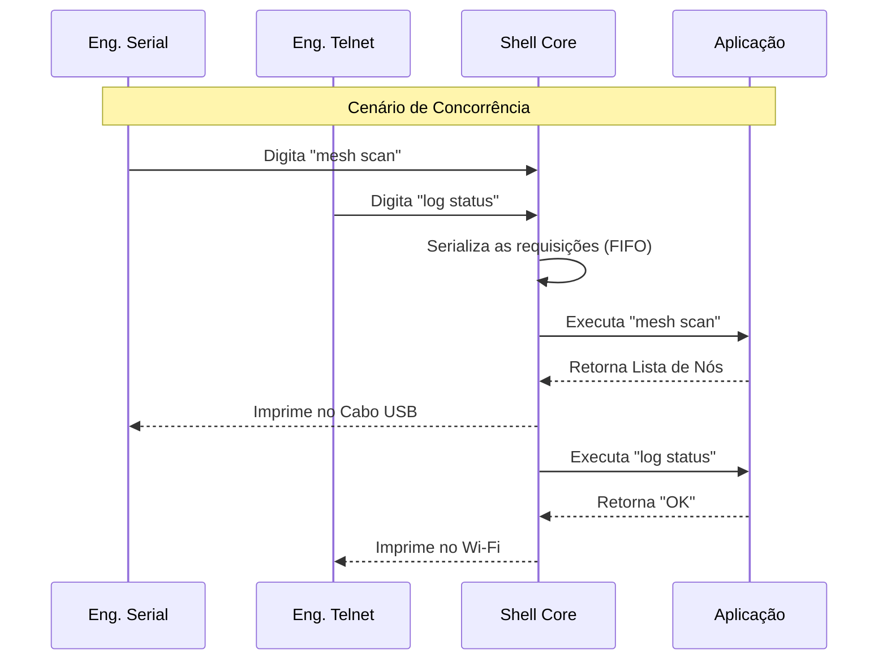
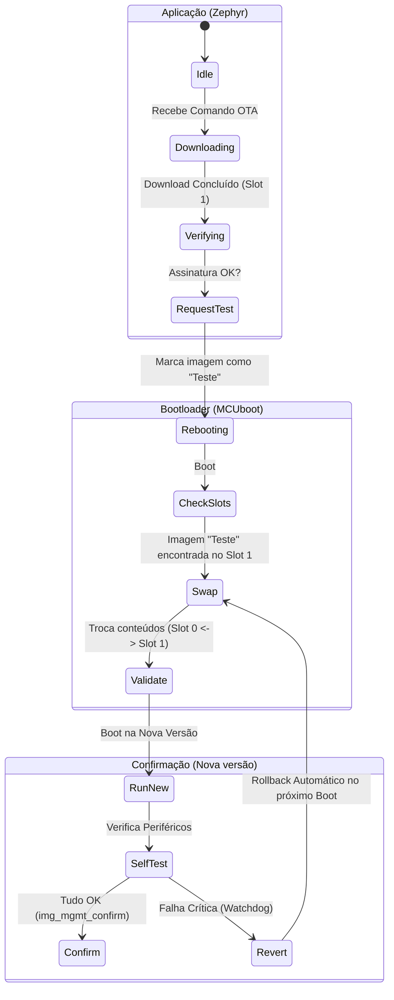
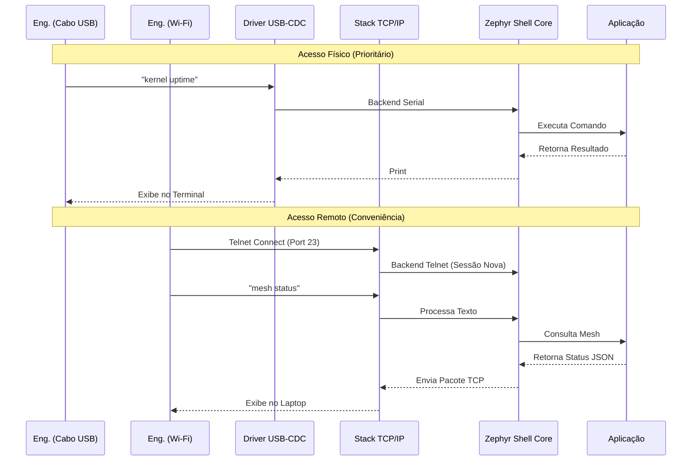

# System Architecture

| Metadado            | Detalhe                                                |
| :------------------ | :----------------------------------------------------- |
| **Projeto**         | Sistema de Monitoramento Industrial Distribuído (SMID) |
| **ID do Documento** | SMID-DOC-002                                           |
| **Versão**          | 1.0                                                    |
| **Status**          | Pronto                                                 |
| **Data**            | 23/12/2025                                             |
| **Hardware**        | ESP32-S3 (Gateway) + ESP32/nRF (Nodes)                 |
| **OS:**             | Zephyr RTOS 3.7.x                                      |

---

## 1. Visão Geral (C4 Context Diagram)
O diagrama abaixo ilustra o contexto de alto nível do sistema e suas interações com o ambiente externo.

## 2. Arquitetura de Hardware (Gateway)

- **SoC**: ESP32-S3-WROOM-1 (Dual Core, 240MHz, 16MB PSRAM).
- **Display**: ST7796S (3.5" TFT) via SPI (40MHz), 320x480 RGB.
- **Armazenamento**: Flash Interna particionada para suporte a Rollback (MCUboot).

## 3. Arquitetura de Software

### 3.1 Zephyr Stack

Uso do Zephyr RTOS, utilizando uma arquitetura em camadas para desacoplar o hardware da lógica de negócio.

### 3.2 Subsistemas de gerenciamento

## 4. Fluxo de Dados (Sequence Diagram)

### 4.1 Mensagem crítico

**O fluxo crítico do sistema**: Recebimento de um alarme via Mesh e atualização da tela.

### 4.2 Atualização dos dados

Este diagrama detalha como garantimos que a alta frequência de mensagens da rede Mesh não bloqueie a renderização gráfica, utilizando Filas de Mensagens (Message Queues) do RTOS para desacoplamento.

- **Problema**: Se o LVGL tentar desenhar no exato momento que o rádio Bluetooth recebe um pacote, pode haver corrupção de memória ou atraso na rede.

- **Solução**: O Produtor (Mesh Thread) apenas coloca o dado na fila. O Consumidor (UI Thread) processa quando possível.

### 4.3 Fluxo de Armazenamento de Logs (Persistência)

### 4.4 Concorrência entre UART e Telnet

## 5. Atualização via OTA (Over The Air)

O sistema utiliza uma estratégia de atualização A/B (Dual Slot) gerenciada pelo bootloader MCUboot. Isso garante que o sistema nunca fique num estado inconsistente ("brickado") se a energia cair durante a atualização.

- **Slot 0 (Primary)**: Onde roda a aplicação atual.

- **Slot 1 (Secondary)**: Onde a nova imagem é gravada.

- **Scratch**: Área temporária usada pelo MCUboot para trocar (swap) os conteúdos dos slots.

## 6. Arquitetura de Observabilidade e Debug
O sistema implementa uma interface de diagnóstico bidirecional sobre USB-CDC (Serial), permitindo inspeção em tempo real sem interromper a operação da interface gráfica (HMI) ou da rede Mesh.

### 6.1. Diagrama de Fluxo de Debug (Shell & Log)

### 6.2. Estrutura de Comandos do Shell

O sistema expõe uma árvore de comandos customizados para manutenção em campo:

**kernel**: Comandos nativos (uptime, threads, stacks).

**log**: Controle de níveis de log (ex: log enable info).

**fs**: Manipulação de arquivos (ls, cd, cat).

**app**: Comandos da aplicação específica:

  - `app mesh status`: Mostra vizinhos e rotas.

  - `app ota exec`: Força o início do download.

  - `app storage reset`: Formata a partição LittleFS.

**sensor**: Comando para leitura imediata dos sensores.
